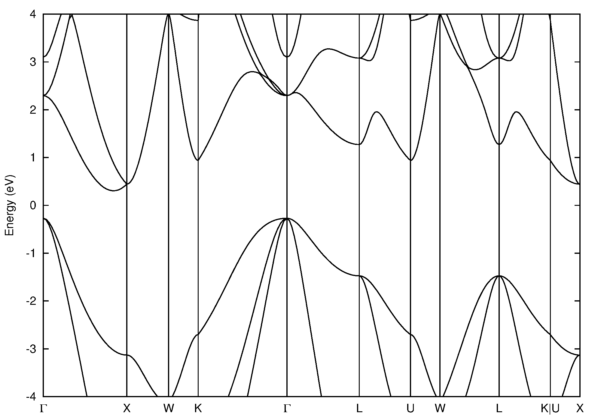

The bands program is used to plot band structures calculated with the [Vienna Ab initio Simulation Package](http://vasp.at).

# Installation
Just compile with `g++ -o bands bands.cc` and put the executable in your `bin` folder.
You will also need [Gnuplot](http://gnuplot.info) installed on your system. Version 5.0 or higher is needed because
a loop over all bands is used in the plot command.

# Usage
Go to your directory that contains the band structure calculation and type `bands`.
The program will read the following files:

* OUTCAR (get number of k-points, bands and Fermi level)
* KPOINTS (get labels and coordinates of high-symmetry k-points)
* EIGENVAL

The program then writes `segment` files that contains the band structure (energy vs. 
k-point for each band). It also writes the `bands.plt` file that contains instructions
to make the graph. As a final step run `gnuplot bands.plt`, this will generate the
actuall graph as `bands.eps`.

# Example
Silicon FCC band structure.

